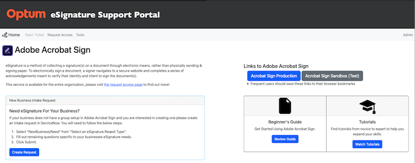

# Optum eSignature Support Portal

<p>The eSignature Support Portal was built by Jacob McNeece to service UnitedHealth Group's employees with their eSignature support needs. The goal of the tool is to automate solutions for common service requests to the internal Optum eSignature Support Team, and give employees access to vital information and functionality in a simplified manner so that they can be self sufficient when utilizing eSignature for their business(es).</p>

### API Calls Simplified

<p>Adobe Acrobat Sign has many different features and functionalities to match a user's requirements for sending out a document for signiture, but not all can be done from the browser solution. Some requires development skills and knowledge of making API calls to Adobe for fetching information or making bulk requests. With the release of the eSignature Support Portal this can all be done by a click of a button and zero development skills.</p>
<ul>This includes:
    <li>Automatting the flow of information for requesting access to Adobe Acrobat Sign using a handful of API calls.</li>
    <li>Supplying end users with the ability to find a Group Admins by entering a {group name} or {email of a colleague} whom has Acrobat Sign access.</li>
    <li>Gives end users the ability to cancel agreements sent out for signature in bulk. {coming soon]</li>
    <li>Supplies end users with information regarding who is the owner of a specific webform in Adobe Sign {coming soon}</li>
</ul>

### One Stop Shop For Everything Acrobat Sign

<p>In addition to simplifying functionality for the common user, the eSignature Support Portal also is the hub for: curreated training material userful for novice to expert Acrobat Sign users, the fastest routes to submitting service requests or incidents to the eSignature Opperations Team, and links to the Adobe Sign tool.</p>


    
## Installation
        
<h3>Step 1: Creating a config.py file</h3>
<p>Save this file in the app directory of this project<p>
 
```python
    class Config(object):
        DEBUG = False
        TESTING = False
        # To make this more secure i could use the Secrets Python module or OS.random
        SECRET_KEY = # Insert PRODUCTION Access Token w: USER READ prviliges
        REQUEST_URL_USERS = # Insert Request URL for PRODUCITON Adobe Sign API
        REQUEST_URL_GROUPS = # Insert Request URL for PRODUCTION Adobe Sign API
        SESSION_COOKIE_SECURE = True

    class ProductionConfig(Config):
        pass

    class DevelopmentConfig(Config):
        DEBUG = True
        SECRET_KEY = # Insert SANDBOX Access Token w: USER READ prviliges
        REQUEST_URL_USERS = # Insert Request URL for SANDBOX Adobe Sign API
        REQUEST_URL_GROUPS = # Insert Request URL for SANDBOX Adobe Sign API 
        SESSION_COOKIE_SECURE = False

    class TestingConfig(Config):
        TESTING = True
        SECRET_KEY = # Insert SANDBOX Access Token w: USER READ prviliges
        REQUEST_URL_USERS = # Insert Request URL for SANDBOX Adobe Sign API
        REQUEST_URL_GROUPS = # Insert Request URL for SANDBOX Adobe Sign API
        SESSION_COOKIE_SECURE = False
```
    
<h3>Step 2: Download requirements.txt</h3>

```console
    pip install -r requirements.txt
```
<h3>Step 3: Run Commands in Termainal to Run Flask Project</h3>

```console
    source env/bin/activate
```
```console
    export FLASK_APP=run.py
```
```console
    export FLASK_ENV=production
```
```console
    flask run
```
<p>Select the link provided in the terminal<p>

```console
    Running on http://127.0.0.1:5000
```

## Using the Tool

1. [ Home Page. ](#home)
2. [ Open Ticket. ](#ticket)
3. [ Request Access. ](#request)
4. [ Group Admin Check. ](#admin)
5. [ Cancel Agreements. ](#cancel)

<a name="home"></a>
## 1. Home Page

Overview:
    The Home page of the eSignature Support Portal site hosts training material and a high level overview of Acrobat Sign, while also being the source of truth for links to UHG's instance of Acrobat Sign (na1 and na3 shards). 
    
    Training Material:
    The training material is a link to Adobe's Helpx articles and videos. The helpx training is something that is maintained by Adobe and is open to the public. The videos which can be accessed by clicking 'watch videos' on the eSign Support Portal and are easily consumible since they are 2-4 minutes in length. These videos can be anything from setting up agreement routing to creating a workflow. While the beginners guide is a HTML file also hosted and maintained by Adobe that helps a new user setup and start using Adobe Acrobat Sign for the first time. It focuses on setting up your signature and updating your user profile.
    
    High Level Overview of Acrobat Sign:
    This is just a simple paragraph that introduces the user to Acrobat Sign and eSignature. It lets the user understand that this product is for capturing eSignatures which can help reduce postage costs, paper footprints, and automate routing, and expedite the signature process
    
    UHG's Acrobat Sign Links:
    This is a HTML button that host the most updated links to our Adobe Sign product. Currently we have an intranet page that the support team cannot access that hosts outdated links that have since been changed due to a DNS migration. With hosting links on a tool developed by the (me) a member of the operations team it can easily be changed during a future DNS migration so that end users are accessing the proper links. This is done by simply changing the 'href=#' link on the button.

<a name="ticket"></a>
## 2. Open a Ticket

Overview:
    When users cannot solve an issue themselves they need access to our support team. In order to track issues and create a formal process with SLA's we utilize service now for incidents or something needs to be fixed with the tool, a request to add a new business to our Acrobat Sign instance, and creating an enhancement request to Adobe for a golabl change to their product that allows it to work for others better.
    
    Incident Ticket:
    An incident ticket at UHG is first vetted by the Help Desk. In order to reduce the volume of requests going to our Optum eSignature support team the help desk will first try and solve the issue. In order to open a ticket with the help desk one must call or create a ticket with a chat bot. The link in the eSignature Support Portal pushes users to the chat bot page on their browser and allows them to submit a ticket to the help desk. If the ticket is not able to be fixed by the help desk it will get forwarded to the eSignature Support Team.
    
    Net New Request:
    The net new request is for groups (businesses) that are part of UHG that are looking to utilize Acrobat Sign to excelerate their business processes. Acrobat Sign is the preferred solution for UHG and is part of their desktop services charges and is no charge to the business. They can simply click the button on the eSiganture Support Portal 'Submit a request' fill out the form and it will get routed directly to the eSignature Support Team who will setup a meeting within 24 hours to kickoff the onboarding process for this new business group.
    
    Enhancement Request:
    This feature is currently unavailble and that is why the button is disabled. When this form is stood up by the ServiceNow and eSig support team it will be a customer facing form that allows them to submit enhancement requests to be reviewed and passed on to Adobe if they are legitimate.

<a name="request"></a>
## 3. Request Access
    
sometext
    
<a name="admin"></a>
## 4. Group Admin Check
    
sometext
    
<a name="cancel"></a>
## 5. Cancel Agreements
