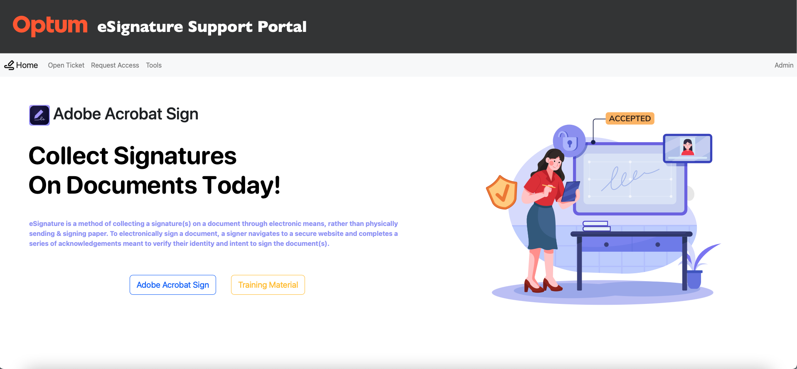
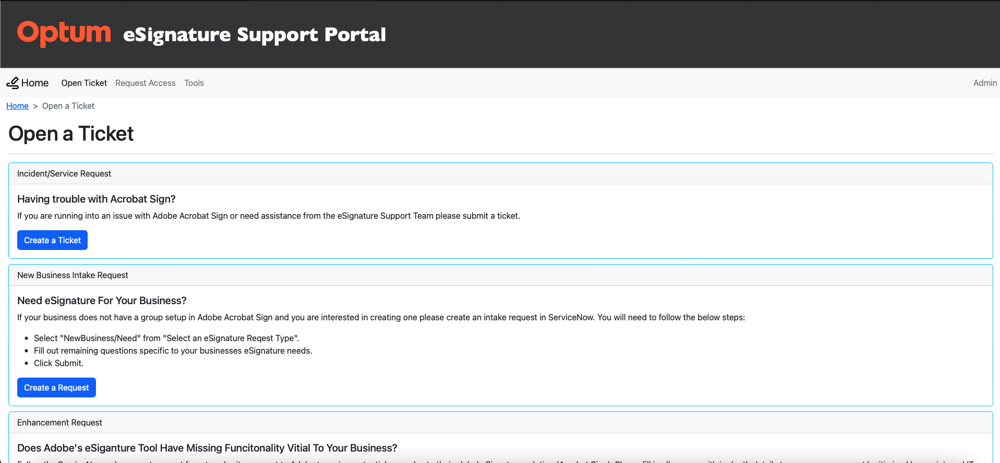
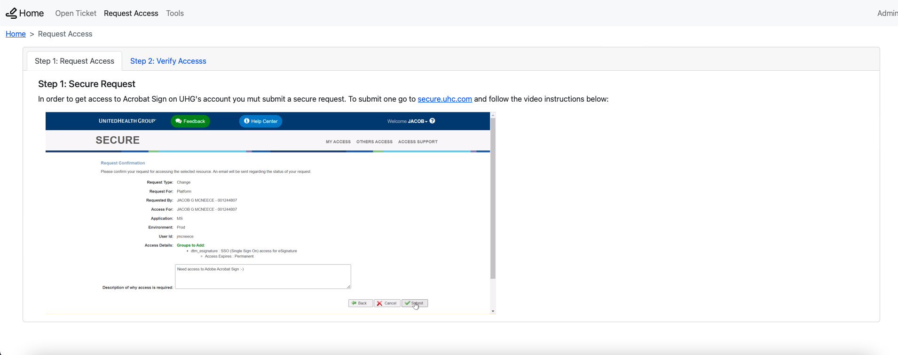
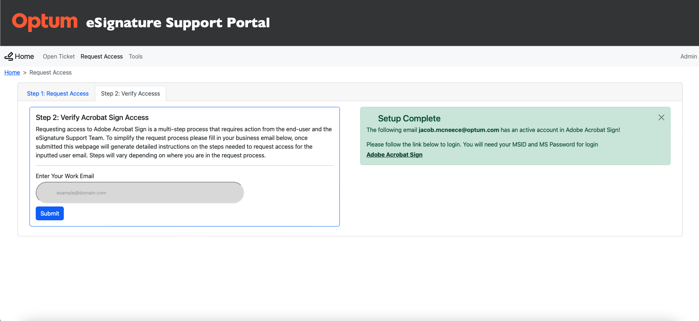
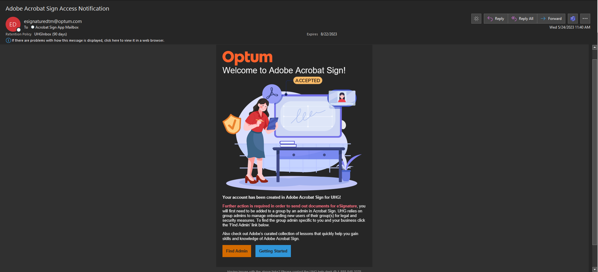
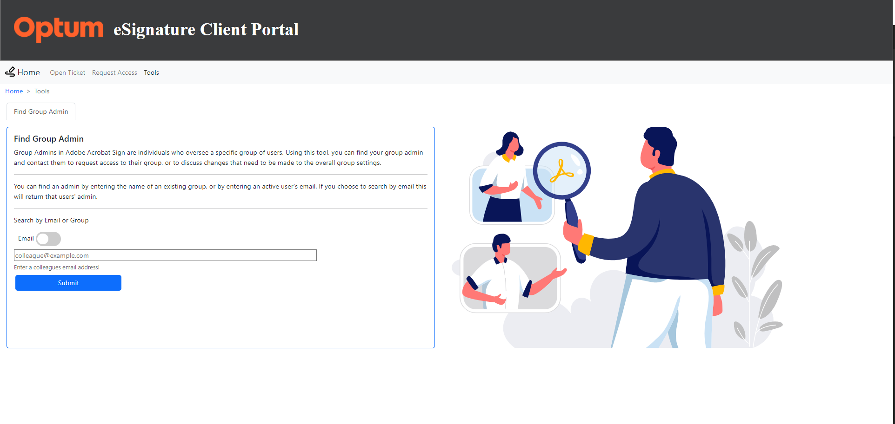
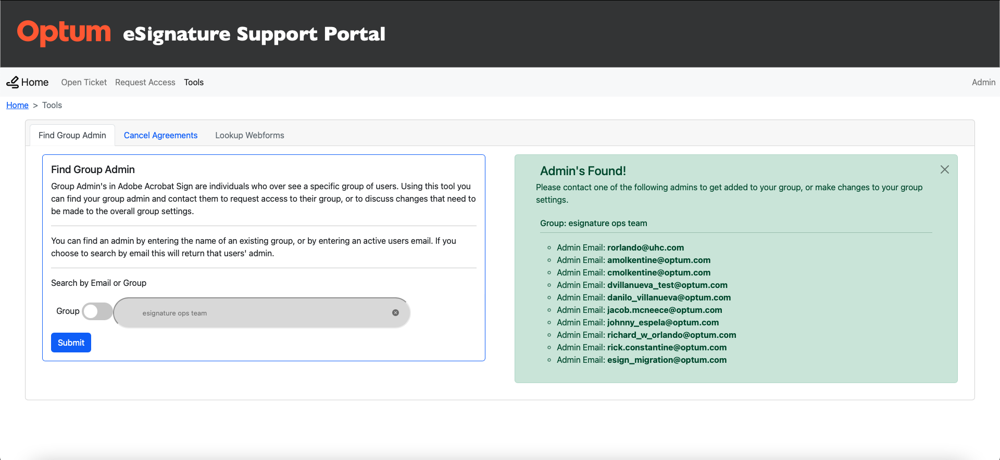
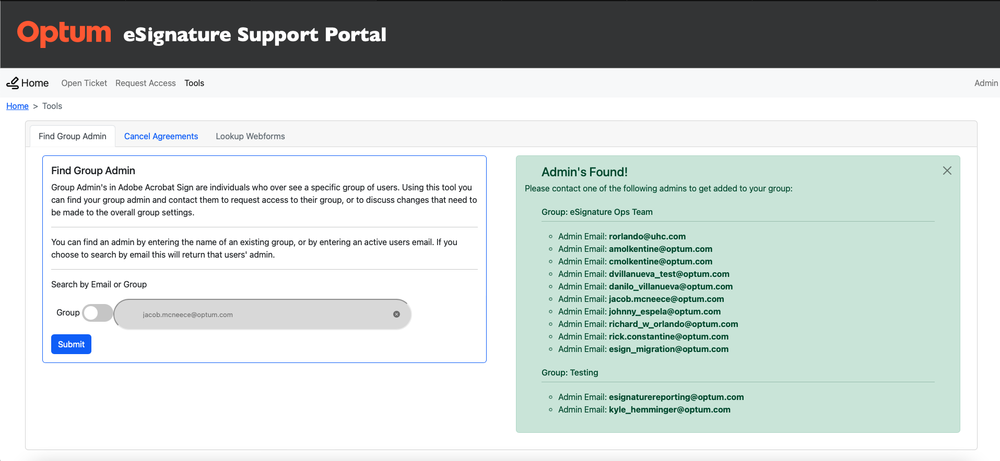

# Optum eSignature Support Portal

The eSignature Support Portal was created to service UnitedHealth Group's employees with their eSignature support needs. The goal of the tool is to automate solutions for common service requests to the internal Optum eSignature Support Team, and give employees access to vital information and functionality in a simplified manner so that they can be self-sufficient when utilizing eSignature for their business(es).

### Adobe Sign Entitlement Simplified

Adobe Acrobat Sign offers a few different account management solutions, but there were limitations with each due to UHG's account auditing requirements and employee infrastructure. Because of this the there were sacrafices made in the user experience for user account provisioning that caused a large spike in Optum eSignature support tickets (from 2020- to 2023). To remediate this the client portal uses API's with Adobe Sign, Adobe's Admin Console (UMAPI), ServiceNow, and Active Directory to automate user account provisioning in a manner that gives the user the best possible experience and comunicates between all of several cloud services to meet UHG's auditing and employee infrastructure requirements.

<ul>This includes:
    <li>Taking in a user's business email and validating its format and domain to ensure it is claimed by our organization</li>
    <li>Validating user credentials and status in Active Directory using AD APIs</li>
    <li>Creating audit trails for user account creation (requirement for applications that accrue a cost to UHG) via ServiceNow APIs</li>
    <li>Checking Adobe Sign accesss using Adobe Sign Rest APIs</li>
    <li>Creating Federated IDs in Adobe's Admin Console and Product entitlement for Adobe Sign using Adobe's user management APIs</li>
    <li>Creating automated tickets for monitoring API portal exceptions using ServiceNow APIs</li>
</ul>

### One Stop Shop for Everything Acrobat Sign

In addition to simplifying Adobe Sign entitlement, the eSignature Support Portal also is the hub for: curated training material for novice to expert Acrobat Sign users, the fastest routes to submitting service or incident requests to the eSignature Operations Team, and links to the Adobe Sign tool.

    

## Using the Tool

1. [ Home Page. ](#home)
2. [ Open Ticket. ](#ticket)
3. [ Request Access. ](#request)
4. [ Welcome Email. ](#email)
5. [ Group Admin Check. ](#admin)

## 1. Home Page

#### Overview:
The Home page of the eSignature Support Portal hosts training material and a high-level overview of Acrobat Sign, while also being the source of truth for links to UHG's instance of Acrobat Sign (na1 and na3 shards). 
    

#### Training Material:
The training material is Adobe's Helpx articles and experience league videos curated by their support team. The training videos and articles are maintained by Adobe and open to the public. The training videos which can be accessed on the eSignature Support Portal are easily consumable since they are 2-4 minutes in length. These videos can be anything from setting up agreement routing to creating a workflow. This videos are extremely helpful to our organization to reduce tickets caused by customer knowledge gaps for tasks in Adobe Acrobat Sign.
    
#### High Level Overview of Acrobat Sign:
This is just a simple paragraph that introduces the user to Acrobat Sign and eSignature for UHG. It lets the user understand that this product is for capturing eSignatures which can help reduce postage costs, paper footprints, automate routing, and expedite the signature process.
    
#### UHG's Acrobat Sign Links:
The Acrobat Sign links are simply just HTML buttons that host the most up to date links to UHG's Acrobat Sign product. This was extremely helpful in the DNS migration in 2022 when Adobe changed the webUI link from echosign to adobesign. By hosting the links on a tool developed by the eSign support team a member of that team can easily change the HTML buttons so that end users are accessing proper links.

## 2. Open a Ticket

#### Overview:
When users cannot solve an issue themselves and need assistance from UHG's operational support team it can sometimes be a headache. This is because they are not informed about the formal process for engaging UHG's support team. In order to track issues and automate SLA's UHG utilizes ServiceNow for incidents and service request to their operations team. This includes requesting something be fixed, a request to add a new business to UHG's instance of Acrobat Sign, and creating an enhancement request for a global change to Adobe's Acrobat Sign product.

    
#### Incident Ticket:
The eSignature Support Portal has a button for the best link for raising an incident with Acrobat Sign. This will route the ticket to UHG's help desk who take the first crack at solving the incident to reduce the volume of requests going to UHG's eSignature support team. The link in the eSignature Support Portal pushes users to the chat bot webpage in their browser to submit a ticket. This will save the user a lot of time because the alternative is calling the help desk which can be time wasted on the phone. If the ticket is not able to be fixed by the help desk it will get forwarded to the eSignature Support Team and they will have a 24-hour SLA to reach out to the customer to resolve the issue.
    
#### Net New Request:
The net new request is for groups (businesses) that are a part of UHG, and are looking to utilize Acrobat Sign to accelerate their business processes. A potential new business admin can simply click the button on the eSiganture Support Portal 'Submit a request', fill out the form, and will get routed directly to the eSignature Support Team, who will setup a meeting within 24 hours to kick off the onboarding process for this new potential business group.
    
#### Enhancement Request:
This feature is currently unavailable and is why the button is disabled on the user interface. When this form is completed by the ServiceNow and eSignature support team it will be a customer facing form that allows businesses to submit enhancement requests to be reviewed by our operation team and passed on to Adobe (if legitimate) for a potential new function of Acrobat Sign.

## 3. Request Access
    
#### Overview:
Request access is broken down in two steps on the eSignature Portal. Step 1: The request process, this includes a video that is hosted on the eSignature Support Portal that shows the end user how to complete a Secure request process. This is something users struggle with so the video eliminates any confusion on how to complete the request. Step 2: Is the meat and potatoes of the eSiganture Portal, which request access check. This tool takes a user inputted email that gets processed by a combination of python functions data retrieved by API calls to verify or notify the user where they are in the request process. If they have competed the request process it will let them know all is good to go, or if they have not it will give them feedback of steps that need to be taken to finish their request. This process currently very cumbersome and many users struggle with understanding if they have indeed taken the correct actions to get access (due to lack of feedback during the request process). Additionally, when users come with questions regarding if they have access it is a very manual process for the eSiganture support team to look up where they are in the request process. It requires the eSignature support team to check several sources of information (Acrobat Sign, the Adobe Console, and a few internal tools) to give corrective action for their specific request. Currently UHG has eighteen thousand users and growing so this is one of the most popular issues.

#### Request Access:
When requesting Acrobat Sign a user must be added to a security group in Active Directory. For UHG this can be accomplished by submitting a group request in Secure (secure.uhc.com). This process requires the user to input the platform, operating system, ID type, pick their ID, find the security group, state the length they wish to have access for, and state the reasoning for the request. All of that information is not always known by the employee making the request, especially new hires. To simplify the process I screen recorded myself making the same Secure request so users can follow along when requesting access. In the past we had used written instructions which worked for most part but was still difficult for some to follow. 
    

#### Verify Request:
The original goal of this tool was to verify where a user is in the request process, but has since grown to include additional functionality. The verify request tool goes through several checks using python functions to see where the user is in the request process. It takes a user's email and first verifies that the email entered a valid email (valid username and domain). During the valid email check, the function also runs the domain against a list of claimed domains in the UHG console (using a CSV file) to ensure the domain is claimed. If the domain is not claimed the user cannot get access to Acrobat Sign (no exceptions), otherwise the tool continues on. After that check passes, an API call is made to Adobe to verify if the email entered exist in Acrobat Sign. If it does, it will check the group the user is in using another API call. By default, users originally previsioned in Acrobat Sign are assigned to the 'default group', if the user is in the default group then the UI flashes the user an alert, and suggests that they use another tool in the portal to find an admin (find admin tool) to get them assigned to a group. If the user is not in the default group that means they have access and the UI flashes an alert notifying them that they have the required access necessary, and to go ahead and login. If the email is not found by the API but passed the email validation then the tool checks if they are an active user in UHG's active directory using AD APIs. If they are a valid account in Active Directory thebn the tool makes a UMAPI call to the Adobe admin console to create a Federated ID with Adobe Sign product entitlement. Now if that Federated ID already exist, the UI then flashes and alert to open an incident ticket with our support team (further investigation is required to determine if this is dual entitlement or a seperate issue.

## 4. Welcome Email

#### Overview:

The welcome email is a tool for our support team to provide feedback to the customer that their account has indeed been created for UHG's instance of Adobe Acrobat Sign, and that their is aditional actions that need to be taken including getting added to a group by a group admin and doing the currated Adobe Sign beginner course in Adobe's experience league. The group admin tool described in the next section is linked in the email helping persuade the usesr to start their before reaching out to the internal support team. And as mentioned above the training is fed to the user to curb users knowledge gaps.

## 5. Group Admin Check

#### Overview:
    
The group admin check is a tool used to find a business's group admin. There are 350+ businesses that utilize Acrobat Sign for UHG. Because of the volume of users and groups it isn't feasible for the support team to manage group assignment, because of that group management is self-service. Each group when onboarded to Acrobat Sign is assigned at least one group admin, these individuals manage onboarding users in Adobe Acrobat Sign, the settings of the group, and are the point of contact for all things Acrobat Sign for their business. Because users are assigned to the default group (with limited access to functionality) when they first become provisioned to Acrobat Sign, they must contact their group admin to get access to a group that allows them to utilize Acrobat Sign. Typically, users don't know who that is but may know the group name or an email of a colleague who has the access they require. What the group admin tool does is runs several lines of code to match that group name or colleague email to information retrieved from API calls to Adobe to find their group admin. 

#### Searching by Group:

The search by group takes a group name and runs it through a script to find all the admins of that group. It starts by comparing the group name entered against a list of all groups retrieved by an Adobe rest API call. If there is a match it will take that group ID and run it against another API call, which returns all the users from that group along with other details about each user. If there is not a match it notifies the user to try another group name or search by email. One of the details pulled by the previous API call is group admin boolean value (true or false). If the boolean is true then it will save that user's email to a dictionariy and flash an Alert on the UI notifying the user of all admins in that group they could contact (you can have more than one group admin).

#### Searching by Email:
    
The search by email takes a user input (an email representing a colleague who they wish to mimic their access) and runs it against a python function that checks if the username and domain are valid as well as if the domain is claimed in UHG's acrobat sign console. If the validation fails the user is alerted and they should try again. If not, the email is run against an API call to see if that email matches an existing user. If there is no match the user is alerted and asked to try another email or search by group name. If there is a match then the user ID is pulled and ran against another API call to see if they're part of an existing group. If they are not (then they are part of default group) the user is notified that the email is an active user but don't have the necessary group access requeired. On the other hand, if they are part of a group, that group ID is pulled and used in another API call. That API call finds all the users in that group and pulls supporting data about if they are a group admin or not. All users that are group admins are added to a dictionary with their email.
    

